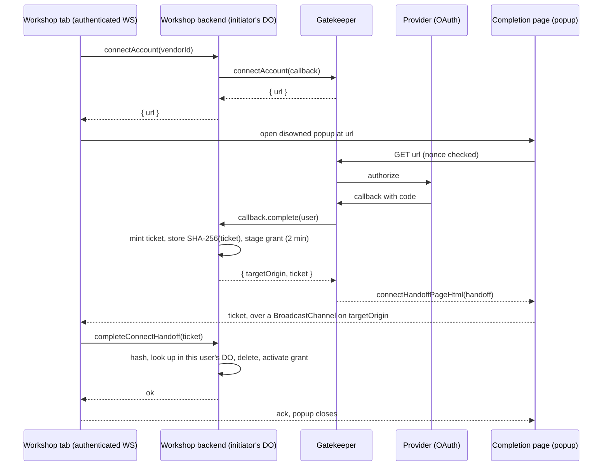
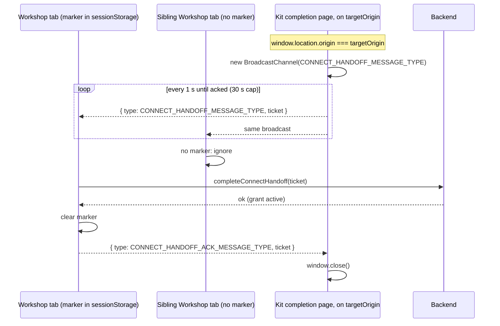
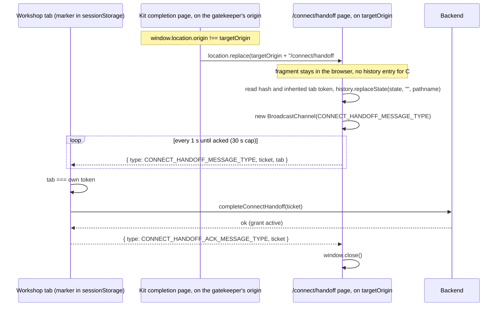
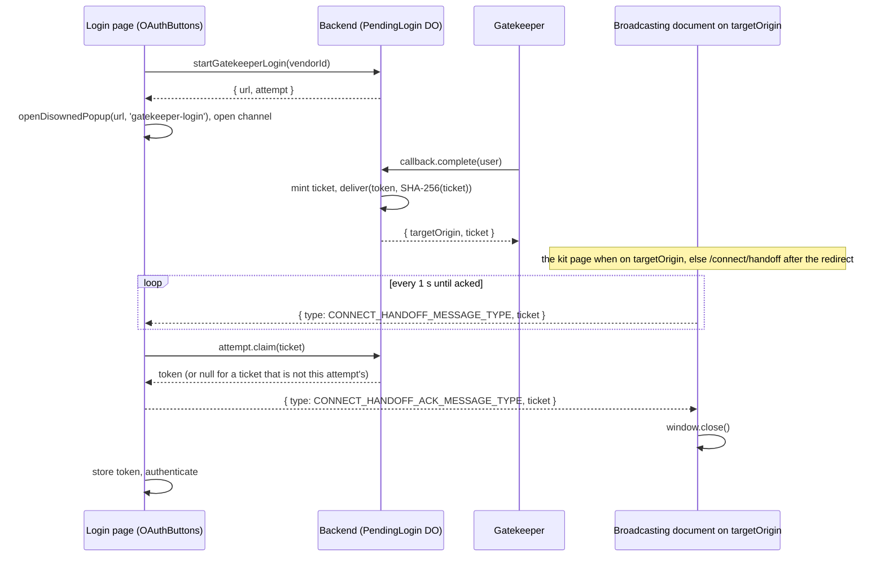

# The connect handoff

Every gatekeeper connect, reconnect, ensure-resources and sign-in flow ends the same way: the
gatekeeper's final page hands a single-use **ticket** back to the Workshop, and the Workshop
redeems it over the session of the user who started the flow. This document describes the ticket,
the one transport that carries it, and why the flow is shaped the way it is. The sign-in specifics
(identity, scopes, configuration) are in [oauth-signin.md](oauth-signin.md).

Code, by layer:

- `packages/workshop-shared/src/gatekeeper.ts` — the `ConnectHandoff` type, the envelope type
  `CONNECT_HANDOFF_MESSAGE_TYPE` (also the `BroadcastChannel` name) and the ack type
  `CONNECT_HANDOFF_ACK_MESSAGE_TYPE`.
- `packages/workshop-backend/src/connect-handoff.ts` — `PENDING_HANDOFF_LIFETIME_MS`,
  `handoffTargetOrigin(env)`, `newSecretToken()` / `hashSecret()`. Minting and redemption live in
  `UserDurableObject` (`user.ts`, the "Connect handoff" section) for account connects and in
  `PendingLogin` / `LoginConnectCallbackImpl` (`auth/login-flow.ts`) for sign-in.
- `packages/gatekeeper-kit/src/connect-pages.ts` — `connectHandoffPageHtml(handoff)`, the page a
  gatekeeper serves when its flow has finished. Gatekeepers know nothing else about the handoff.
- `packages/workshop-frontend/src/connectHandoff.ts` — `openDisownedPopup`, `openConnectWindow`,
  `useConnectHandoffListener`, `broadcastHandoffUntilAcked`, `HANDOFF_PATH`;
  `ConnectHandoffPage.tsx` and `routes/connect.handoff.tsx` — the Workshop's own `/connect/handoff`
  page; `components/auth/OAuthButtons.tsx` — the sign-in listener.

## The threat and the ticket

A connect URL (`GatekeeperVendor.connectAccount()`), a reconnect URL and a sign-in URL
(`PublicApi.startGatekeeperLogin()`) are all **bearer capabilities**: whoever opens one can finish
the flow, and nothing in the HTTP requests ties the browser that finishes to the user who started.
An attacker can therefore start a connect in their own Workshop account and phish a victim into
opening the URL; without a further check the victim's provider credentials would land in the
attacker's account. The reverse holds for sign-in: a victim finishing an attacker's sign-in attempt
would hand the attacker a session as the victim.

The ticket closes this. `GatekeeperConnectCallback.complete()` (and `reconnectComplete()`) returns
a `ConnectHandoff = { targetOrigin, ticket }`:

- `ticket` is a fresh 256-bit secret, rendered as 64 lowercase hex characters
  (`newSecretToken()`). Only its SHA-256 hash is stored, and only in the initiator's own state: the
  `pendingHandoffs` table of the initiating user's `UserDurableObject` for a connect or reconnect
  (`#stagePendingHandoff`), or the `PendingLogin` DO of the attempt for a sign-in
  (`PendingLogin.deliver`). It is valid for `PENDING_HANDOFF_LIFETIME_MS` (two minutes) and is
  deleted on its first presentation, whatever happens next.
- `targetOrigin` is the Workshop's origin, from deployment configuration only
  (`handoffTargetOrigin(env)` reads `PUBLIC_BASE_URL`). A request's `Origin` header or anything the
  client asserts is never consulted, because either could route the ticket to an origin the
  attacker controls.

Until the ticket is redeemed the grant is **staged**: the gatekeeper holds credentials, but no
Workshop account can reach them. Redemption happens only over the initiator's own RPC session, and
what binds it differs by flow. For a connect it is `AuthenticatedApi.completeConnectHandoff(ticket)`
over the initiator's authenticated WebSocket: the hash is looked up in the caller's own DO, and an
unknown or expired ticket is rejected. For sign-in it is `LoginAttempt.claim(ticket)` over the
not-yet-authenticated `PublicApi` session that holds the `attempt` capability (the `PendingLogin`
DO stub `startGatekeeperLogin()` returned, the only handle on that DO the client is ever given): the
DO answers with the parked session token only for the matching hash. Whoever finishes a flow they
did not start therefore gains nothing. When an attacker starts the flow and phishes a victim into
finishing it, the ticket lands in the victim's browser and the hash in the attacker's state: the
attacker's session holds the hash but never sees the ticket, and the victim's tabs hear a ticket no
session of theirs can redeem. When a victim starts the flow and its URL leaks to an attacker who
finishes it, the attacker holds the ticket and the hash sits in the victim's state: the attacker's
session cannot redeem it, and the tab token described below keeps the attacker from handing it back
to the victim's tab through a link. Either way the staged grant expires and, for a connect, is
revoked.



## One transport: a same-origin BroadcastChannel

The ticket travels from the popup to the Workshop tab over exactly one mechanism: a
`BroadcastChannel` named `CONNECT_HANDOFF_MESSAGE_TYPE`, carrying the envelope
`{ type: CONNECT_HANDOFF_MESSAGE_TYPE, ticket }`. The browser scopes a channel to the origin of the
document that opens it, so the envelope reaches the Workshop's listeners only when it is posted from
a document on the Workshop's origin — and that origin is `targetOrigin`, supplied by the backend.
The invariant is therefore: **the ticket only ever reaches a document on the backend-supplied
`targetOrigin`.** This is the same guarantee `postMessage`'s `targetOrigin` argument gives, obtained
without a window handle.

The completion page reaches a document on `targetOrigin` by one of two routes, decided by a single
comparison in `connectHandoffPageHtml`: `window.location.origin !== target`.

The receiving tab answers a redeemed ticket with `{ type: CONNECT_HANDOFF_ACK_MESSAGE_TYPE, ticket }`
on the same channel. The broadcasting page repeats its envelope once a second until it hears that
ack, because a broadcast has no source: a Workshop tab whose RPC session is mid-reconnect would miss
a one-shot, and since the ticket is single-use server-side the repeats cost nothing. On the ack the
page calls `window.close()`. After 30 seconds with no ack it stops and tells the user it could not
reach the Workshop.

Every popup is opened by `openDisownedPopup(url, name)`: `window.open('', name, ...)` with an empty
URL, then `popup.opener = null`, then `popup.location.replace(url)`. No page the popup visits ever
sees a `window.opener`. Disowning is done by hand rather than with the `noopener` feature because
that feature makes `window.open()` return null even on success, indistinguishable from a blocked
popup.

## Account connect, gatekeeper on the Workshop origin

This is the public deployment: `packages/router` serves the frontend and mounts every gatekeeper
under `/gatekeeper/<name>/*` of the same origin, so the completion page is already on
`targetOrigin` and broadcasts directly.

`openConnectWindow(url)` opens the disowned popup (named `gadgets-connect`) and writes a marker,
`gadgets.connectPending`, into this tab's `sessionStorage` with the current time. The marker decides
*which of the user's tabs* redeems a broadcast: `sessionStorage` is per-tab and reload-stable, so the
tab that opened the popup redeems, and its siblings — which hear the same broadcast — stay quiet
instead of racing it and toasting an error. The marker is spent only by a successful redemption and
ages out after 30 minutes (`CONNECT_PENDING_LIFETIME_MS`), which bounds the connect-nonce and
consent-screen time a legitimate flow can take, so an abandoned popup's marker does not race sibling
tabs forever. It is not a security control; security rests on the ticket being scoped server-side to
the initiating user and, for the cross-origin route, on the tab token described below.

`useConnectHandoffListener` is mounted once per window: by `ConnectHandoffListener` inside the
authenticated shell (`routes/__root.tsx`), or by `BlueprintLandingPage` when a signed-out visitor
signs in on that standalone page and the shell's listener is not mounted. It ignores anything that
is not a well-formed envelope (`parseHandoffEnvelope`), redeems each ticket at most once per session
(`attempted`), and only when the marker is present. A successful `completeConnectHandoff` clears the
marker and posts the ack; a rejection is surfaced as the toast "Could not complete the connection"
with the server's message.



## Account connect, gatekeeper on another origin

An internal deployment serves gatekeepers from a different host than the Workshop, and a shared
gatekeeper may serve several Workshops. The completion page then finds itself on an origin other
than `targetOrigin`, where a channel it opened would reach no Workshop listener. So it navigates the
popup to the Workshop's own handoff page:

```js
window.location.replace(target + "/connect/handoff#" + encodeURIComponent(envelope.ticket));
```

`/connect/handoff` is `HANDOFF_PATH` in `connectHandoff.ts`, served by the route
`routes/connect.handoff.tsx` and rendered by `ConnectHandoffPage`. `routes/__root.tsx` treats the
path as public and always standalone (`isHandoff`): the page renders with no app shell and no
header, needs no session and makes no RPC call, and never waits on auth. On mount it reads
`window.location.hash` once, immediately replaces the history entry with the bare pathname
(`history.replaceState`) so the ticket leaves the address bar, and parses the fragment with
`ticketFromHandoffFragment`. It then calls `broadcastHandoffUntilAcked(ticket, tab, ...)`, which
opens the same channel and repeats an envelope with the same one-second cadence, 30-second give-up
and ack handling as the kit page. The envelope differs in one field, `tab`, described next; the
listeners in the Workshop tabs are otherwise the ones described above.

### The tab token

The kit page can only ever broadcast the ticket the gatekeeper embedded in it, for a flow reached
through its single-use URL. `/connect/handoff` broadcasts whatever ticket its URL carries, so on its
own it would be a way to put a ticket in front of a Workshop tab that did not earn it: an attacker
who finished a flow the victim started (the victim's connect URL leaked) holds a ticket whose hash
sits in the victim's state, and a link to `/connect/handoff#<ticket>` clicked by the victim within
two minutes would have the victim's own tab redeem it, connecting the attacker's provider account to
the victim's Workshop (or, for sign-in, logging the victim in as the attacker).

What closes this is a token the Workshop tab gives itself the first time it opens a popup
(`openDisownedPopup`, key `gadgets.handoffTab` in `sessionStorage`, kept for the tab's life). A
browser starts a `window.open()`ed popup with a copy of the opener's `sessionStorage`, so the popup
carries the token of the tab that opened it and nothing else does. `ConnectHandoffPage` reads the
token from its own storage and puts it in the envelope as `tab`; `parseHandoffEnvelope` in every
listener accepts an envelope that names a tab only when it names its own, and the page refuses to
broadcast at all when it holds no token ("This link isn't valid"). An envelope without the field is
the kit page's, and needs none. The token is minted before `window.open()` and never rotated because
a popup reused by name (`gadgets-connect`, `gatekeeper-login`) keeps the storage copy it was created
with.

The residual exposure is a handoff link the victim opens *from* a document that already holds the
token — the Workshop tab itself, or a tab opened from it — within the ticket's two-minute life; the
copy of `sessionStorage` follows such openings too.



### Why the fragment is safe

- A URL fragment is never sent to a server: the browser strips it before the request for
  `/connect/handoff` leaves, so the Workshop's router and asset server never see the ticket, and it
  appears in no access log.
- It is not in any `Referer`: fragments are excluded from referrers by definition, so neither the
  navigation to `/connect/handoff` nor anything that page loads carries the ticket. (The kit page's
  own referrer policy is `strict-origin-when-cross-origin`, from its `<meta name="referrer">`; it
  governs only what else the cross-origin navigation reveals, which is at most the gatekeeper's
  origin.)
- `location.replace()` leaves no history entry for the completion page, and `ConnectHandoffPage`
  strips the fragment from the current entry before anything else runs, so the ticket is not in the
  session history either.
- The ticket is single-use and valid for two minutes, so even a leaked one is worth little.
- The destination is `targetOrigin`, which the backend derived from `PUBLIC_BASE_URL`. The
  completion page throws if `handoff.targetOrigin` is not exactly an origin, and redirects to that
  origin and no other. The ticket therefore reaches a document on `targetOrigin` — the invariant
  above — exactly as `postMessage(envelope, targetOrigin)` enforces.
- One deployment condition follows: `/connect/handoff` on `targetOrigin` must be served by the
  Workshop directly, not answered with an HTTP redirect elsewhere, because a browser carries a
  fragment across a redirect whose `Location` has none. A Cloudflare Access login redirect is the
  case to know about; it sends the fragment to the deployment's own Access team domain, and the
  flow then fails rather than leaks, but the popup shares the tab's Access cookie so a live session
  does not hit it.

### Why the popup must not mount the connect listener

A `window.open()`ed popup starts with a copy of its opener's `sessionStorage`, including the
`gadgets.connectPending` marker. If `/connect/handoff` mounted `useConnectHandoffListener` it would
hold a marker, hear its own broadcast, and race the real Workshop tab to redeem the ticket — the
ticket would then be spent in a window with no session to activate the grant on. The standalone
branch in `__root.tsx` does not render `ConnectHandoffListener`, and `ConnectHandoffPage` mounts
nothing of its own.

## Sign-in

Sign-in uses the same popup and the same two routes. `OAuthButtons.start()` calls
`PublicApi.startGatekeeperLogin(vendorId)`, receives `{ url, attempt }`, and opens `url` with
`openDisownedPopup(url, 'gatekeeper-login')`. Sign-in providers are admin-allowlisted, but the popup
traverses provider pages all the same, and none of them may hold a handle to the login page.

`LoginConnectCallbackImpl.complete()` mints the ticket, parks the session token under its hash in
the `PendingLogin` DO and returns `{ targetOrigin, ticket }`; the gatekeeper renders
`connectHandoffPageHtml` exactly as for a connect. The login page opens the channel itself, and on
every envelope it may act on (`parseHandoffEnvelope`, including the tab-token check above) calls
`attempt.claim(ticket)`. `PendingLogin.claim` resolves null for a ticket that is
not this attempt's — a broadcast can carry another tab's sign-in or an account-connect ticket — and
also while the attempt is still pending, so the page keeps listening. For the matching ticket it
returns the token once and clears the result. The page then posts the ack (the popup closes on it),
stores the token and re-authenticates. A `claim` that rejects (an expired attempt, or a sign-in the Workshop's
`LoginConnectCallbackImpl` refused, such as one with no verified email) is shown in the page's error
banner.

While a claim is in flight the page stops polling `popup.closed`, so a popup that closes itself on
the ack is not read as the user cancelling; polling resumes after a null answer.



## Why not postMessage

A completion page could deliver the ticket with `window.opener.postMessage(envelope, targetOrigin)`,
which enforces the same origin invariant. It is not used, for three reasons.

- An `opener` handle is reverse-tabnabbing exposure. The popup traverses pages the deployment does
  not vouch for — the provider's consent screens, and for `gatekeeper-mcp` an MCP server whose
  endpoint the user pasted. Any of them could navigate the authenticated Workshop tab to a phishing
  page through `opener.location`. Disowning the popup before navigation removes the handle from
  every page in the flow.
- A provider that sets `Cross-Origin-Opener-Policy` severs the handle anyway, so a flow relying on
  it fails on exactly the providers that are careful. A disowned popup is indifferent to COOP.
- One transport is simpler to reason about than two. The origin guarantee comes from one property
  (a `BroadcastChannel` is same-origin by construction) and one decision (redirect when not on
  `targetOrigin`), and the connect and sign-in listeners are the same shape.

## Future configuration: many Workshops, one gatekeeper

A shared gatekeeper serving several Workshops needs no change here. Each Workshop's own callback
(`UserDurableObject.#stagePendingHandoff`, `LoginConnectCallbackImpl.complete`) mints `targetOrigin`
from its own `PUBLIC_BASE_URL`, and the completion page redirects to whatever `targetOrigin` the
handoff it was given carries, so the ticket lands on the Workshop that started the flow and the
gatekeeper never learns or configures the set of Workshop origins for this purpose.

Open question (Kenton): how the gatekeeper authorizes which Workshops may bind to it at all. The
handoff binds a finished flow to the browser that started it; it says nothing about whether the
Workshop that started it was entitled to call `connectAccount()` on this gatekeeper.

## Failure modes the user sees

| What the user sees | When | Where the string lives |
| --- | --- | --- |
| "Pop-up blocked. Please allow pop-ups and try again." | `window.open()` returned null | `openDisownedPopup`, `workshop-frontend/src/connectHandoff.ts` |
| "This link has expired" / "Start the connection again." | The connect URL's nonce is expired or already used | `INVALID_LINK_HTML`, `gatekeeper-kit/src/connect-pages.ts` (most gatekeepers render their own equivalent) |
| "This link isn't valid" / "Go back to the Workshop and start the connection again." | `/connect/handoff` opened with no well-formed ticket in the fragment | `ConnectHandoffPage`, `workshop-frontend/src/ConnectHandoffPage.tsx` |
| "This window couldn't reach the Workshop" / "Go back to the Workshop tab and start the connection again." | No ack within 30 s of the first broadcast, or the browser has no `BroadcastChannel` — typically no Workshop tab holds the marker (the initiating tab was closed, or the link was opened in another browser) | Kit page: `unreachable()` in `connectHandoffPageHtml`; Workshop page: `ConnectHandoffPage` after `broadcastHandoffUntilAcked` reports `onUnreachable` |
| Toast "Could not complete the connection" with "This connection attempt has expired. Please try again." | The ticket was redeemed after two minutes, twice, or by a different user's session | `UserDurableObject.completeConnectHandoff`, `workshop-backend/src/user.ts`; toast title in `ConnectHandoffListener.tsx` and `BlueprintLandingPage.tsx` |
| Banner "This sign-in attempt has expired. Please try again." | `attempt.claim()` on an attempt whose result was never delivered within 10 min, or whose delivered token went unclaimed for two minutes | `EXPIRED_MESSAGE`, `workshop-backend/src/auth/login-flow.ts`; rendered by `OAuthButtons` |
| Banner with the refusal (e.g. no verified email, sign-ups disabled) | `LoginConnectCallbackImpl.#deliver` refused the sign-in and called `PendingLogin.fail(reason)`; the gatekeeper itself only supplies the email, or none | `LoginConnectCallbackImpl.#deliver`, `auth/login-flow.ts` |

When a ticket is never redeemed, the `UserDurableObject` alarm sweeps the pending record after
`PENDING_HANDOFF_LIFETIME_MS` (`#armHandoffSweep` / `alarm`): a staged **connect** holds a grant in a
reachable gatekeeper DO, so `GatekeeperUser.revoke()` is called on it; a staged **reconnect** left
nothing live, and its credentials stop being committable when the gatekeeper's own stage expires.
`PendingLogin`'s alarm wipes an unclaimed sign-in result the same way. The user sees nothing for
these beyond the popup's "couldn't reach the Workshop" page; the connection simply never appears.
